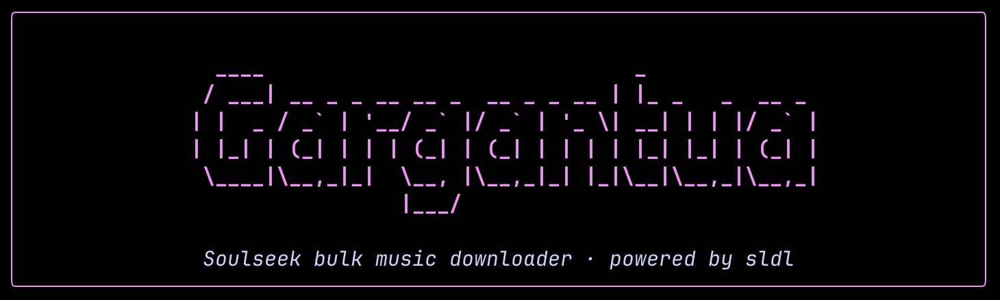

<p align="center">
  
</p>

# gargantua

Gargantua is a small Docker image that wraps [sldl](https://github.com/fiso64/sldl) — a
batch downloader for [Soulseek](https://www.slsknet.org/) — behind a colourful
terminal UI. Point it at a Spotify playlist (or a CSV) and it will pull every
track in your preferred quality.


## One-command run 

Build once, then run with the playlist URL as a positional argument:

```bash
git clone git@github.com:jean-voila/gargantua.git && cd gargantua
docker build -t gargantua .
docker run --rm -it \
  -v "$PWD/data:/data" \
  -v "$PWD/downloads:/downloads" \
  gargantua -m "https://www.youtube.com/playlist?list=<id>"
```

For Spotify URLs, add your credentials:

```bash
git clone git@github.com:jean-voila/gargantua.git && cd gargantua
docker run --rm -it \
  -e SPOTIFY_ID=... \
  -e SPOTIFY_SECRET=... \
  -v "$PWD/data:/data" \
  -v "$PWD/downloads:/downloads" \
  gargantua "https://open.spotify.com/playlist/<id>"
```

Downloads land in `./downloads`; logs and the sldl index in `./data`.


## Highlights

* **No bundled binary** — `sldl` is fetched from its official GitHub release at
  build time (pinned to a known version).
* **No mandatory credentials** — if you don't pass any, Gargantua generates a
  random Soulseek identity on the fly. New usernames are created automatically
  on first connection by Soulseek itself.
* **Pretty terminal UI** — a live, coloured dashboard shows the playlist
  progress, in-flight tracks, recent successes/failures and a final summary.

## Prerequisites

* **Docker** + **Docker Compose**
* A **Spotify playlist URL** or a **`.csv` file** placed in `./data`
* (Recommended) a VPN container such as
  [Gluetun](https://github.com/qdm12/gluetun) for `network_mode: container:gluetun`

## Quick start

```bash
git clone <this repo>
cd gargantua
# edit docker-compose.yml — at minimum set SPOTIFY_LINK or drop a CSV in ./data
docker compose up --build
```


## Configuration

Everything is configured via environment variables in `docker-compose.yml`.

### Soulseek identity *(optional)*

| Variable        | Default     | Description                                                    |
| --------------- | ----------- | -------------------------------------------------------------- |
| `SLSK_USERNAME` | *generated* | Soulseek username. Auto-generated as `gargantua-<random>` if absent. |
| `SLSK_PASSWORD` | *generated* | Soulseek password. Random 24-char string if absent.            |

When credentials are auto-generated they are written to `/data/credentials.txt`
(mode `600`) so subsequent runs can reuse them.

### Input *(at least one is needed)*

| Variable        | Description                                                      |
| --------------- | ---------------------------------------------------------------- |
| `PLAYLIST_URL`  | Spotify, YouTube, Bandcamp or MusicBrainz playlist URL — or a single YouTube video URL (`watch?v=`, `youtu.be/<id>`, `shorts/<id>`), in which case yt-dlp fetches the title and passes it to sldl as a search query. sldl auto-detects the type. |
| `TXT_FILENAME`  | Plain text file in `/data`, **one search query per line**. Falls back to `playlist.txt` then to the first `*.txt` found. Lines starting with `#` are comments. Prefix `a:` for an album download. Gargantua wraps each line in quotes and feeds it to sldl as a `--input-type=list`. |
| `CSV_FILENAME`  | CSV file in `/data`. Falls back to `playlist.csv` then to the first `*.csv` found. |
| `SPOTIFY_ID` / `SPOTIFY_SECRET` | Spotify API client credentials. **Required for Spotify URLs** since Spotify deprecated anonymous playlist access in 2024 (free, from [developer.spotify.com](https://developer.spotify.com)). |
| `SPOTIFY_LINK`  | Deprecated alias for `PLAYLIST_URL` (still honoured). |

Resolution order: `PLAYLIST_URL` → `SPOTIFY_LINK` → `TXT_FILENAME`/`*.txt` → `CSV_FILENAME`/`*.csv`.

#### Text file format

```text
# comments and blank lines are ignored
Daft Punk - Around the World
Aphex Twin Windowlicker
a:Boards of Canada - Music Has the Right to Children
https://www.youtube.com/watch?v=dQw4w9WgXcQ
```

### Tuning *(all optional)*

| Variable               | Default                          | Maps to sldl flag         |
| ---------------------- | -------------------------------- | ------------------------- |
| `PREF_FORMAT`          | `flac`                           | `--pref-format`           |
| `NAME_FORMAT`          | `{artist( - )title|filename}`    | `--name-format`           |
| `CONCURRENT_DOWNLOADS` | `4`                              | `--concurrent-downloads`  |
| `STRICT_CONDITIONS`    | `false`                          | `--strict-conditions`     |
| `FAST_SEARCH`          | `true`                           | `--fast-search`           |
| `WRITE_PLAYLIST`       | `true`                           | `--write-playlist`        |
| `YOUTUBE_TITLE_FALLBACK` | `true`                         | (gargantua-side) for YouTube playlists, retries any track that wasn't found using just the video title — without the `Artist -` prefix that sldl extracts from the video name. |
| `MINIMAL`              | `false`                          | (gargantua-side) terse output: a single startup line, one progress bar, one line per completed track, one summary line. No banners, panels, or rules. Equivalent to `-m` / `--minimal` on the CLI. |
| `SLDL_EXTRA_ARGS`      | *(empty)*                        | passed verbatim to sldl   |

`STRICT_CONDITIONS`, `FAST_SEARCH` and `WRITE_PLAYLIST` accept any of
`true`/`false`, `1`/`0`, `yes`/`no`.

## Output

* **Music** in `/downloads`
* **Log file** at `/data/sldl.log`
* **sldl index** at `/data/index.sldl`
* **m3u playlist** alongside downloads when `WRITE_PLAYLIST=true`
* **Auto-generated credentials** (if applicable) at `/data/credentials.txt`

## Architecture note

`sldl` is shipped only as a `linux/amd64` binary, so the image uses
`platform: linux/amd64`. On Apple Silicon / arm64 hosts, Docker runs it through
QEMU emulation transparently — slower at startup, but functional.
